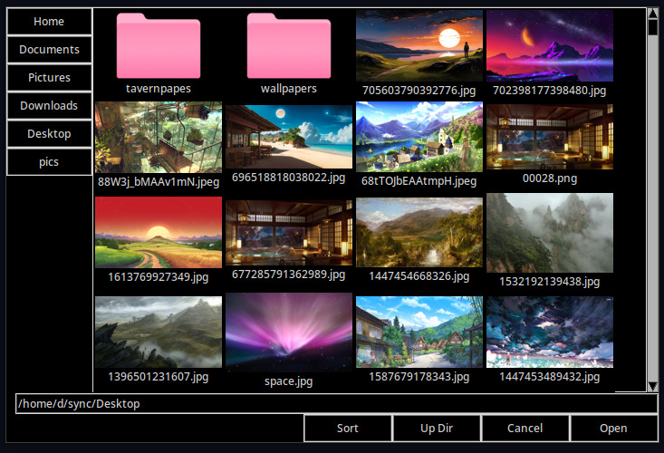

 # Pikeru: The File Picker with Good Thumbnails

Pikeru is the only filepicker for linux that has working thumbnails and works on any desktop environment or window manager. The Gtk patch for getting thumbnails in the filepicker proves that implementing thumbnails correctly at the toolkit level is never going to happen and a standalone program is needed.



## Command Line Arguments
Pikeru takes several command line args and returns the selected file(s) to stdout separated by newlines.

- `-t title`: Sets the title displayed at the top of the Pikeru window.
- `-m mode`: Determines the mode of file selection operation:
  - `file`: Select a single file.
  - `files`: Select multiple files.
  - `dir`: Select a single directory.
  - `save`: Save a file with the specified filename. Prompt user if file already exists.
- `-p path`: Specifies the initial directory to display when Pikeru launches.

Planned but not yet implemented:
- `-e windowId`: Specifies the X11 window ID of the parent window if Pikeru should be transient to an existing window.
- `-i mime_list`: Defines a list of MIME types accepted during file selection.

## Usage

Most current software is not designed to use a standalone filepicker, but it is possible in chromium-based browsers using the included patch:
```
# follow the instructions on chromium's dev website to download the repo
git apply < /path/to/chromium.patch
# then build as usual
```
Then to use it set the environment variable `CUSTOM_FILEPICKER=/path/to/this/program/main.py`

## Roadmap to get a proper filepicker on linux
1. Write a basic but useable and good filepicker (this one).
2. Badger the develpers of Gtk or web browsers or anything else to add support for standalone filepickers now that we have a good one.
3. Write a professional grade one since it will then be worth the time investment.

## License
Pikeru is Public Domain.
The Chromium patch is licensed under the same BSD-style licence as chromium because it is derived from chromium source code.
